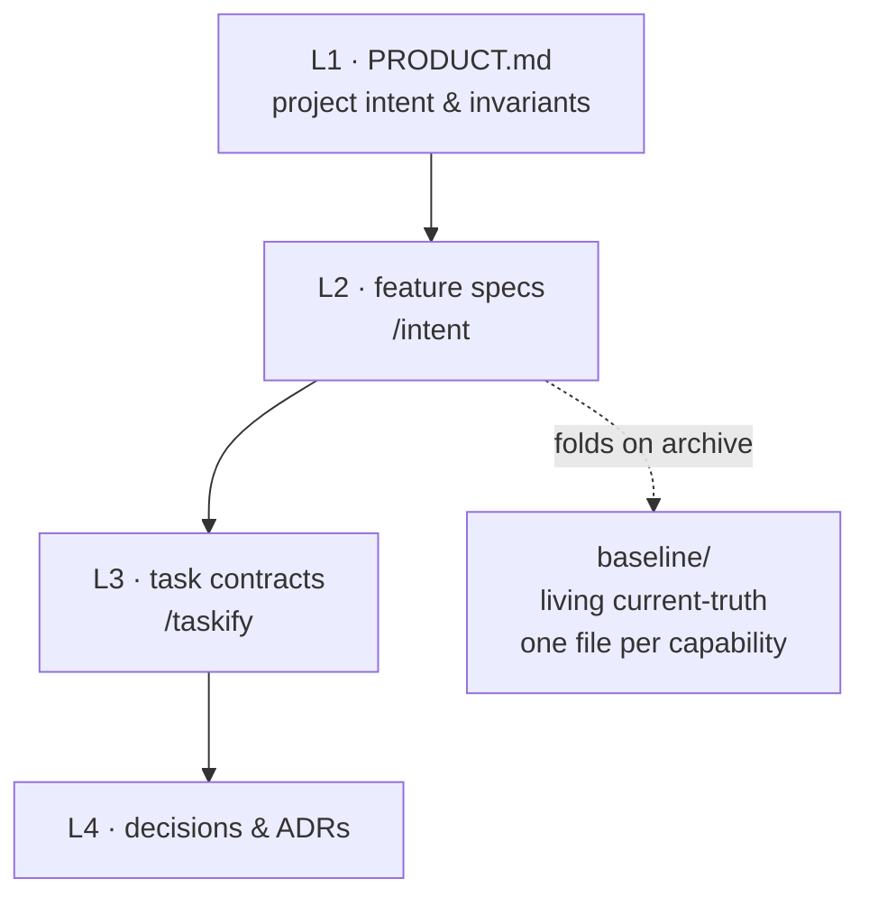
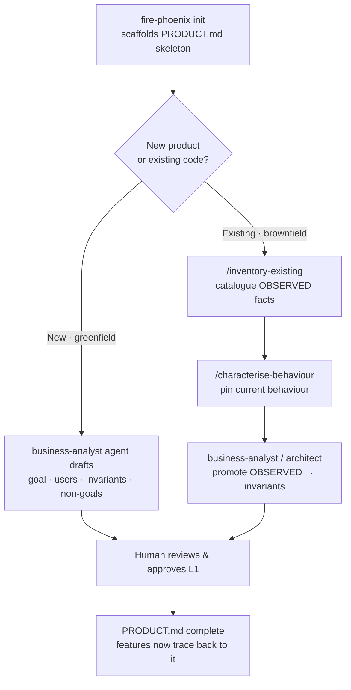
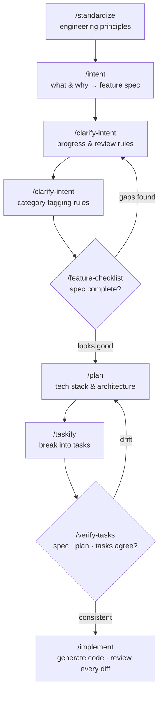
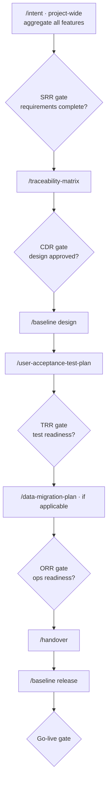

# Fire Phoenix — Intent-Driven Development User Guide

## Contents

- What Is Intent-Driven Development?
- Before You Begin
- The Six-Step Process
- Detailed Example: Building Bookshelf
- Key Principles
- Beyond Slash Commands: Role Agents
- Running a Full Cycle as a Workflow
- Waterfall and Large-Project Workflows
- Customizing Fire Phoenix: Presets and Extensions
- Measuring the Delivery Loop
- Command Reference — Every `fire-phoenix` Command
- Key Skills at a Glance
- The Full Skill Catalog
- Closing Note

## What Is Intent-Driven Development?

Intent-Driven Development (IDD) is a way of building software where the **starting point and source of truth is a written, versioned statement of intent** — not the code. Every feature begins as a plain-language description of what should exist and why. That intent is refined into a specification, the specification is turned into a technical plan, the plan is broken into small units of work, and only then is code generated — by an AI agent, under a human's explicit direction and approval at every step.

The spirit of the method is simple: **code is a projection of intent, not the other way around.** If the code and the written intent ever disagree, the intent wins, and the code is regenerated to match it — never silently patched in a way that lets it drift from what was actually asked for. This keeps a project's real decisions (why a feature exists, what "done" means, what trade-offs were accepted) in durable, readable documents instead of buried in commit history or in one person's memory.

IDD assigns each delivery role — product owner, business analyst, architect, project manager, engineer, tester, DevOps — a place in this flow: what they author, what they approve, and what they must never hand off to an AI agent unsupervised. AI agents in this method are **authoring aids**. They draft specifications, plans, task breakdowns, and code; they never approve their own work, sign off on a release, or make a call that changes what was actually asked for without surfacing it to a human first.

The method also distinguishes changes by their weight. A one-line fix and a new payment feature are not held to the same amount of process — but both still pass through the same single delivery spine, scaled up or down by how much blast radius the change carries, never routed through a separate shortcut. Fire Phoenix makes that scaling **intrinsic**: each unit of work is classified into a **lane** (mechanical, routine, consequential, or critical) that automatically decides which gates apply and how much sign-off a change needs.

This guide walks through that spine using Fire Phoenix, a command-line toolkit that implements Intent-Driven Development as AI agent roles plus a single verb set — `/change <verb>` — over a **living baseline** of what the system does today. You can drive each step through `/change` or through the individual slash commands it routes to (`/intent`, `/plan`, `/taskify`, …); both do the same thing.

## Before You Begin

This guide assumes the `fire-phoenix` command-line tool is already installed on your machine and available on your terminal's PATH. It also assumes you have:

- A terminal / shell.
- Git installed (Fire Phoenix uses it to track your project and, optionally, to create feature branches automatically).
- An AI coding assistant installed in your terminal or editor that supports Fire Phoenix's slash commands and custom agents (for example, an assistant that reads an agent-definition folder such as `.claude/agents/` or `.cursor/agents/`).

Verify your installation before starting:

```bash
fire-phoenix --version
```

## The Six-Step Process

Fire Phoenix commands detect the feature you're actively working on from your current Git branch (for example, a branch named `001-bookshelf`). Switching features is as simple as switching branches.

Every installed skill ships both a Bash and a PowerShell script variant; Fire Phoenix automatically picks the right one for your operating system — you never need to choose.

The flow, end to end. `init` and product intent are done once per project; the `/intent` → `/implement` stretch repeats for each new feature:

```mermaid
flowchart TD
    A["fire-phoenix init"] --> B["Establish product intent<br/>PRODUCT.md · L1 · once per project"]
    B --> C["/standardize"]
    C --> D["/intent"]
    D --> E["/clarify-intent"]
    E --> F["/plan"]
    F --> G["/taskify"]
    G --> H["/verify-tasks · optional"]
    H --> I["/implement"]
    I -. "next feature" .-> D
```



### The `change` verb set (one command for the whole spine)

The steps above are also reachable through **one** command — `/change <verb>` — so you don't have to remember separate slash commands:

| Verb | What it does |
|---|---|
| `/change new <id>` | Start a unit of work: scaffold its delta folder and **classify its lane** (mechanical → critical). |
| `/change intent` · `design` · `tasks` · `implement` · `verify` | The spine steps — routed to `/intent`, `/plan`, `/taskify`, `/implement`, `/verify-tasks`. |
| `/change analyze` | Read-only consistency check before implementing — flags acceptance criteria with no covering task, orphan tasks, and unresolved placeholders. |
| `/change status` | Ask the tool where you are: which artefacts exist, the lane, and the next verb. |
| `/change archive` | Fold the finished change into the **living baseline** and archive it. |
| `/change recover` | Brownfield bootstrap: reconstruct intent (from a supplied doc) and spec (from a named module) when code exists but no intent does. |
| `/change baseline` | Inspect what the system does today. |

**The living baseline.** `init` scaffolds a `baseline/` directory — one file per capability — that is the single answer to *"what does this system do today."* When a change is archived, its spec-delta **folds** into the baseline (last-fold-wins; conflicting edits are flagged for a human), so the current-truth surface stays current instead of drifting. The lane a change is classified into decides its gates and approval weight automatically — **critical** changes cannot be signed off without recorded developer / tester / product-owner confirmation.

**Intent comes first — automatically.** If you ask to build, plan, taskify, or write a spec and there is no intent yet for that feature, Fire Phoenix does not push ahead on a guess: it starts by developing the intent. On a fresh project it runs `/intent` (interactive mode asks you to confirm first; auto mode just starts and logs it). On an existing codebase with no captured intent, it runs `/change recover` (`recover-intent` + `recover-spec`) to write down what the code does today before anything changes it. Either way, requirements/specs are the *output* of the intent step — there is no separate "write the spec" command to jump to ahead of it.

### Step 1: Initialize a Project

In your terminal:

```bash
# Create a new project directory and initialize Fire Phoenix inside it
fire-phoenix init bookshelf

# Or initialize Fire Phoenix in the current directory
fire-phoenix init .
```

To skip the interactive integration picker and target a specific AI assistant directly:

```bash
fire-phoenix init bookshelf --integration claude
```

**Adopting IDD on an existing codebase?** Use `--archetype brownfield` instead of a plain `init`. Brownfield mode scaffolds the same governance file hierarchy, but uses templates tagged `OBSERVED`, `INFERRED (confidence level)`, or `UNKNOWN` — because on an existing codebase, intent has to be reconstructed from what the code actually does before anyone can safely change it:

```bash
fire-phoenix init . --archetype brownfield
```

Brownfield init also runs a deterministic, read-only probe of what is already there (languages, build manifests, test dirs, git age — mechanical facts only, no inference) and records the findings for you: the `STATUS.md` "What was here at init time" snapshot is pre-filled with `OBSERVED:` facts, declared build/test/lint commands land in the `commands:` block of `.fire-phoenix/context.yml`, and a pre-existing docs directory is noted as `paths.existing_docs`. The archetype itself is recorded in `context.yml`, so later re-inits and every agent session know the project is brownfield — even if your project already had its own `CLAUDE.md`/`AGENTS.md` (which init never overwrites), the refreshed managed block at the end of that file carries the brownfield discipline rules.

**Migrating a legacy system to a new implementation?** Use `--archetype migration`. It composes the brownfield source-archaeology scaffold with a greenfield target and stamps a **non-waivable parity obligation** into `PRODUCT.md` / `STATUS.md` — every migrated capability must pass a parity ledger before its old path is frozen, and the ledger never closes while the old path is live. The Next-Steps recipe walks recover → risk-map → seam-analysis → per-slice parity/reconciliation → gated cutover:

```bash
fire-phoenix init . --archetype migration
```

The archetype defaults to `greenfield`. To skip the governance scaffold entirely (for projects that already have their own governance model), pass `--no-scaffold`.

**During init, you'll be asked four short questions** (each falls back to a sensible default if you're running non-interactively):

- Output language for written artefacts (default: English).
- Interaction language for prompts and confirmations (default: English).
- Technical fluency of the non-technical roles on your team — `non-technical`, `familiar`, `fluent`, or `technical` (default: `non-technical`).
- Technical fluency of the technical roles on your team — `junior`, `mid`, `senior`, or `staff` (default: `mid`).

These four answers calibrate how the AI adapts its tone, vocabulary, and depth of explanation for your team. All four also have direct command-line flags (`--lang-output`, `--lang-interaction`, `--non-tech-role-level`, `--tech-role-level`) if you'd rather script the setup.

**At the end of init**, Fire Phoenix creates an initial commit automatically, so your working tree starts clean. Use `--no-git` to skip both the git initialization and the auto-commit. If you run init inside a directory that already has uncommitted changes, the auto-commit step is skipped automatically so you don't lose any work.

**Two configuration files** appear under a `.fire-phoenix/` directory after init:

- `context.yml` — shared with your team and checked into version control. Holds file paths, governance settings, and team-wide defaults for language and preferences.
- `user-context.yml` — personal to you, and excluded from version control. Holds which feature and intent file you're currently working on, plus any personal overrides. Each person on the team has their own; it's created automatically the first time you run a command that needs it.

At the start of every session, your AI assistant reads both files and merges them, with your personal file taking priority if the two ever disagree.

### Establishing Product Intent (L1) — Once Per Project

Right after you initialize, and before you specify your first feature, establish your **product intent** — the file `PRODUCT.md` that `init` scaffolds at the top of your project. This is the **L1** layer: the project-wide statement of why the system exists, who it serves, what must *always* hold true (its **invariants**), how it is expected to scale, what counts as failure, and what it will deliberately never do. Every feature spec, plan, and task you create later traces back to it, which is why it sits above the per-feature loop rather than inside it:



Alongside this per-feature hierarchy, `init` scaffolds two always-live **heads**: the `baseline/` directory (what the system does today) and the constitution — your project's governing principles, produced by `/standardize`.

`init` deliberately leaves `PRODUCT.md` as a skeleton of `TBD-source` placeholders: the intent has to come from you, not be guessed. Fire Phoenix never auto-fills or auto-amends L1 without a human approving it. You author `PRODUCT.md` **once per project** and revise it deliberately thereafter. Pick the workflow that matches your situation:



**New product (greenfield) — intent comes first.** Use this when you can describe the product's purpose before any code exists. Ask your assistant to use the `business-analyst` agent — the sole author of L1 intent — and tell it you want to establish the product intent:

```
Use the business-analyst agent, interactively. Help me fill in PRODUCT.md for
Bookshelf, a single-user reading tracker: pin down its goal, who it's for, the
rules that must always hold, and what it will deliberately never do.
```

In interactive mode it asks one short, plain-language question at a time — goal and users first, then the load-bearing part: the **invariants** (what must always be true) and the **non-goals** (explicit scope walls). Leave genuine unknowns in the `Open questions` section rather than inventing answers. When the draft looks right, you review and approve it — that human sign-off is what turns the skeleton into a real L1.

**Existing codebase (brownfield / migration) — intent is recovered.** If you initialized with `--archetype brownfield` or `--archetype migration`, your `PRODUCT.md` skeleton already carries the tags `OBSERVED`, `INFERRED (confidence)`, and `UNKNOWN`, because on a live codebase the intent has to be reconstructed from what the code actually does before it is safe to change. Recover it in order:

```
/inventory-existing       → catalogue what's actually here; every line tagged OBSERVED
/characterise-behaviour   → pin down how the parts you plan to change behave today
```

Then bring the findings to the `business-analyst` (or `architect`) agent and, with your approval, **promote** selected observations into real invariants in `PRODUCT.md`. The discipline that matters: an `INFERRED` line is a guess about intent, not a fact — never refactor toward it until a human has promoted it to a confirmed invariant.

**Joining a project that is already underway.** If the project already carries Fire Phoenix materials from earlier work — a colleague's, or a past AI session's — do not assume they still match the code. Ask the `technical-analyst` agent to run its baseline gap assessment first: it classifies every existing material as aligned, stale, conflicting, or missing, and writes an entry map with a prioritized backfill plan to the `analysis/context-baseline.md` file in your documentation directory. Other agents then continue from that map instead of trusting stale documents.

**Emergent intent (optional).** If you genuinely cannot state the product intent up front, build a couple of features first (the steps below), then return to the `business-analyst` agent and lift the invariants and non-goals that recur across those features up into `PRODUCT.md`. Do not skip this permanently — an empty L1 means nothing downstream has an anchor to trace back to.

**Why the human-approval gate?** `PRODUCT.md` is the one file everything else points to. A wrong invariant here propagates into every spec, plan, and task that follows, so an agent never finalizes it alone — you always confirm.

### Step 2: Establish Standards

In your AI assistant's chat interface, use `/standardize` to define the engineering principles the project must follow:

```
/standardize Prioritize code simplicity and maintainability over overly clever implementations. Enforce TypeScript strict mode and Zod validation on every server boundary. UI must meet WCAG AA. Database access flows through repository functions only. Use Vitest for unit tests and Playwright for end-to-end tests; require coverage on every public function.
```

This creates (or updates) a standards document that every later command consults, so the AI never has to be reminded of your conventions twice.

### Step 3: Create the Specification

Use `/intent` to describe what you're building. Focus on the **what** and the **why** — leave the technology choices out entirely at this stage:

```
/intent Build Bookshelf, a single-user reading tracker. Users add books with title, author, and total page count. Each book has a status — wishlist, reading, or finished — and a current-page field. When a book is finished, the user can write a short review and assign a 1-to-5 rating. Books can be tagged with custom categories. The home view shows three shelves grouped by status; tapping a book opens its detail page. No accounts; data persists locally.
```

### Step 4: Refine the Specification

Use `/clarify-intent` to resolve ambiguities the AI has flagged, or to tighten up specific areas:

```
/clarify-intent Focus on the rules around progress tracking and the review/rating flow.
```

### Step 5: Produce a Technical Plan

Use `/plan` to specify the technology stack and architecture — this is the first point in the process where implementation technology is named:

```
/plan Use Next.js 14 with the App Router and TypeScript. Style with Tailwind CSS and shadcn/ui. Persist data through Prisma against a local SQLite file. Read with Server Components and mutate with Server Actions, validating each action input with Zod. No authentication.
```

### Step 6: Decompose and Implement

Generate the task list:

```
/taskify
```

Optionally, validate that the specification, plan, and task list are still consistent with each other:

```
/verify-tasks
```

Execute the plan:

```
/implement
```

**Tip — phased implementation.** For larger projects, implement in phases (for example: Phase 1 — schema and shelves, Phase 2 — book detail and progress, Phase 3 — reviews and tagging). This avoids overloading the AI's working context and gives you a natural checkpoint to validate each stage before moving to the next.

## Detailed Example: Building Bookshelf

The walkthrough below expands the six-step process into a fuller, closer-to-real-life sequence. The command calls, and the two points where the flow loops back to tighten the work before moving on:



### Step 1: Define Standards

```
/standardize Establish principles for Bookshelf. Prioritize code simplicity and maintainability over overly clever implementations. Enforce TypeScript strict mode and Zod validation on every server boundary. UI must meet WCAG AA. Database access flows through repository functions only. Tests run with Vitest (unit) and Playwright (end-to-end), and every public function requires test coverage.
```

### Step 2: Define Requirements

```
/intent Build Bookshelf, a single-user reading tracker. A user adds books with title, author, and total page count. Each book has a status — wishlist, reading, or finished — and a current-page field. When a book is finished, the user can write a short review and assign a 1-to-5 rating. Books can be tagged with custom categories. The home view shows three shelves grouped by status; tapping a book opens its detail page. No accounts; data persists locally on the device.
```

### Step 3: Refine the Specification

```
/clarify-intent The progress field accepts values from 0 to the book's total pages. When progress reaches the total, prompt the user to mark the book as finished. Reviews accept up to 1,000 characters and may be edited until the book moves back to "reading".
```

Continue refining as needed:

```
/clarify-intent Categories are user-defined free-text tags, normalized to lowercase. A book may have any number of categories. Selecting a category from the home view filters the visible shelves to books carrying that tag.
```

### Step 4: Validate the Specification

```
/feature-checklist
```

### Step 5: Generate the Technical Plan

```
/plan Use Next.js 14 with the App Router and TypeScript. Style with Tailwind CSS and shadcn/ui. Persist data through Prisma against a local SQLite file. Read with Server Components, mutate with Server Actions, and validate every action input with Zod. No authentication.
```

### Step 6: Generate the Task List

```
/taskify
```

### Step 7: Validate and Implement

Audit the implementation plan:

```
/verify-tasks
```

Execute the plan:

```
/implement
```

**Tip — phased implementation.** For Bookshelf, a sensible split is: Phase 1 — Prisma schema, repository functions, and the shelves view; Phase 2 — book detail and progress tracking; Phase 3 — reviews, ratings, and category filtering.

## Key Principles

- **Be explicit** about what you are building and why.
- **Avoid naming the technology stack** while you're still specifying the *what*.
- **Iterate** on the specification before you produce a plan.
- **Validate** the plan before you implement it.
- **Delegate** implementation details to the agent — but review every diff.

## Beyond Slash Commands: Role Agents

In addition to the bare `/<skill>` slash commands, `fire-phoenix init` installs **14 role-based custom subagents** into your AI assistant's agent directory:

`business-analyst`, `architect`, `developer`, `test-architect`, `tester`, `bug-fixer`, `code-quality-reviewer`, `code-security-reviewer`, `devops`, `product-owner`, `project-manager`, `scrum-master`, `technical-analyst`, `ux-designer`.

Each subagent is an **AI authoring aid** — it drafts artefacts from your input and from the artefacts other subagents have already produced. Every subagent's definition spells out its inputs, its outputs, and its handover contracts: which artefacts it reads from other roles and which it produces for them. Work flows between roles through those documents, and every path in them resolves through the merged `context.yml` + `user-context.yml` configuration — never hardcoded. Role subagents do not facilitate meetings, interview stakeholders, approve changes, or communicate with third parties on your behalf; a human is always the one who signs off.

For small, low-risk changes that don't warrant a full intent-plan-task cycle, Fire Phoenix uses a lighter version of the same task contract instead of a separate process: the amount of ceremony a change requires — mechanical, routine, consequential, or critical — scales with how much blast radius the change carries, not with who's making it or how urgent it feels.

### Execution Modes

Every agent and skill supports two modes:

- **`interactive`** (the default) — the agent clarifies the task with you, then executes step by step, pausing for your confirmation at each decision point.
- **`auto`** — the agent completes the task using your input, the project's existing context, and its own judgment. Every assumption and non-trivial decision it makes along the way is written to a dated decision log so you can review it later.

Select a mode with a keyword in your first message to the agent (for example, "in auto mode, ..." or "interactively, ...") or by setting the environment variable `FIRE_PHOENIX_AGENT_MODE=auto` for the whole session.

### Where Outputs Land

Role-agent artefacts are organized by the **type of work**, not by which role produced them — for example, architecture notes, decisions, and research all live together, as do testing artefacts, bug reports, and review findings, each under its own top-level folder inside your project's documentation directory. Concretely, the folders are `architecture/`, `analysis/`, `design/`, `product/`, `testing/`, `reviews/`, `bugs/`, `operations/`, `ux/`, `project/`, and `agile/`, all under the documentation directory configured in `context.yml`. This keeps related work discoverable regardless of which agent or person authored it.

## Running a Full Cycle as a Workflow

The six steps above can be run one command at a time — or bundled into a single **workflow** that Fire Phoenix drives from end to end, pausing between steps for you to run each command and at review gates for your approval. A workflow is a named, versioned sequence of steps installed in your project; running one keeps the ordering and the sign-offs explicit so a full cycle is reproducible.

See which workflows are installed:

```bash
fire-phoenix workflow list
```

If the one you want isn't listed, add it from the catalogue:

```bash
fire-phoenix workflow add viet-paracel
```

Three workflows ship with Fire Phoenix:

- `viet-paracel` — the full IDD cycle: intent, then acceptance criteria, plan, taskify, test-cases, and implement, with a review gate between stages.
- `brownfield-cycle` — reverse-engineer an existing system (inventory of what exists, codebase scan, dependency map, risk map, behaviour characterisation) behind an archaeology gate, then recover-spec through to implement.
- `migration-slice` — migrate one behaviour slice under evidence gates, through to a named-approver cutover sign-off.

Trigger a workflow by its ID, passing its inputs as `key=value` pairs with `--input` (short form `-i`), once per value:

```bash
fire-phoenix workflow run viet-paracel -i intent="Let readers rate and review books" -i integration=claude
```

You can also run a workflow straight from a local YAML file instead of an installed ID:

```bash
fire-phoenix workflow run ./my-workflow.yml
```

Any input you omit falls back to its declared default; a required input with no default stops the run with a clear message.

The workflow engine runs a **linear** sequence of steps with human gates — it dispatches commands, sends prompts, and pauses for approval, but it has no branching or loops of its own. Conditional or exploratory work (for example, a brainstorm before intent) is done by composing `change` verbs / running the relevant skill directly, not by an engine-level branch.

**How a run progresses.** As soon as a run starts, Fire Phoenix prints its **Run ID** and an `inspect:` hint, then reports each step as it goes — `▸` started, `✓` completed, `✗` failed, `⏸` paused. What happens at an agent-command step depends on the mode: an **interactive** run (the default) *pauses and hands the command to you*; an **`--auto`** run *runs the command for you*. Both stop at review gates.

**Interactive runs pause for you to run each command (`needs_input`).** This is the key thing to understand about the default mode: Fire Phoenix does **not** run the agent commands itself. When the workflow reaches a step such as `intent`, it prints the exact slash-command to run and pauses with status **`needs_input`** (a yellow `⏸`):

```
  ▸ intent  fire-phoenix.intent …
  ⏸ intent  needs_input

Next: run this in your agent, then resume the workflow:
  /intent Let users rate and review tasks

Resume with: fire-phoenix workflow resume d0a5dd78
```

`needs_input` is **not an error** — it is the workflow handing that step to you. Run the printed command in your own agent session (Claude, etc.), let the skill do its work and answer its questions there, then resume the run by its Run ID:

```bash
fire-phoenix workflow resume d0a5dd78
```

On resume, Fire Phoenix verifies the step produced what it should (or, if the step declares no artefact, completes it on your word and flags it *unverified*), then advances to the next step — which pauses the same way, until the cycle is done. If you lost the printed command, `fire-phoenix workflow status <run-id>` shows the paused step and its exact invocation.

**`--auto` runs the commands for you.** Add `--auto` and Fire Phoenix dispatches each agent command headlessly, with tool permissions granted, proceeding on documented assumptions without stopping to ask — so you are never prompted to run a command by hand. It still stops at the review gates below. Fire Phoenix owns the screen in this mode and shows a compact per-step spinner; add `--stream` to watch the captured agent output live:

```bash
fire-phoenix workflow run viet-paracel -i intent="..." --auto
fire-phoenix workflow run viet-paracel -i intent="..." --auto --stream
```

**Review gates also pause the run — they don't abort it.** Independently of the per-step `needs_input` pauses, the workflow stops at each review **gate** — for instance, "review the generated intent before planning" — and nothing downstream happens until you approve. Both kinds of pause show `⏸` and both resume with the same command (`fire-phoenix workflow resume <run-id>`); the difference is what you do first — for `needs_input` you run the step's command, for a gate you review and approve. If you interrupt a gate prompt (Ctrl+C), the run is **paused, not lost** — it is saved as `⏸` so you can `resume` it later.

**Inspecting runs.** Check one run step by step, or list every run in the project:

```bash
fire-phoenix workflow status RUN_ID   # one run, step by step
fire-phoenix workflow status          # all runs and their status
```

To preview a workflow's steps and inputs before you run it, use `fire-phoenix workflow info <id>`. Running the sequence as a workflow doesn't change what each step produces — it is the same intent, plan, and tasks you would author by hand — but no stage advances without your sign-off.

## Waterfall and Large-Project Workflows

For formal delivery lifecycles — government contracts, regulated industries, or any project requiring phase gates and formal sign-offs — Fire Phoenix provides an additional set of commands layered on top of the core six-step flow:

| Stage | Commands |
|---|---|
| Requirements formalisation | `/intent` in project-wide mode, `/work-breakdown-structure` |
| Traceability | `/traceability-matrix` (requirements → design → tasks → tests → bugs) |
| Phase gates | `/phase-gate` (System Requirements Review, Critical Design Review, Test Readiness Review, Operational Readiness Review, and go-live checklists) |
| Baselines | `/baseline` (an immutable, checksummed snapshot tagged in git) |
| Testing | `/user-acceptance-test-plan` (a business UAT plan with sponsor sign-off) |
| Go-live | `/handover` (runbooks and escalation paths), `/data-migration-plan` (migration strategy and cutover runbook) |

A typical Waterfall sequence layered on top of the six-step IDD flow, gated by formal reviews:



The same sequence as commands, annotated:

```
/intent (project root, project-wide mode)   → aggregate intent across all features
/phase-gate requirements → System Requirements Review (SRR) gate: confirm requirements are complete
/traceability-matrix     → build the requirements traceability matrix before coding starts
/phase-gate architecture → Critical Design Review (CDR) gate: confirm design is approved
/baseline design         → freeze the design baseline
/user-acceptance-test-plan → draft the UAT plan while development is underway
/phase-gate trr          → Test Readiness Review (TRR) gate: confirm test readiness
/data-migration-plan     → plan data migration (if applicable)
/phase-gate orr          → Operational Readiness Review (ORR) gate: confirm ops readiness
/handover                → produce the hand-over package
/baseline release        → freeze the release baseline
/phase-gate go-live      → final gate before go-live
```

## Customizing Fire Phoenix: Presets and Extensions

Fire Phoenix ships a fixed set of skills and role agents, but two mechanisms let you reshape them for your project without forking the tool.

**Presets** override the *templates and command bodies of skills that already exist*. When your project needs `/plan` to always emit a particular architecture section, or `/standardize` to start from your house rulebook, a preset swaps in your version of that skill's template — the command name and its place in the flow stay the same. Presets add nothing new; they change what an existing command produces.

**Extensions** do the opposite: they *add new commands and hooks* that Fire Phoenix did not ship. A team with a bespoke compliance step, or an in-house review that isn't one of the built-in skills, packages it as an extension and installs it alongside the built-ins.

Both are resolved by **priority** and can be **enabled or disabled** without being removed, so you can stack several, try one, and turn it off again without losing it. Both are also managed from their own catalogs, so a team can publish a shared set once and have every project install from it. The `preset` and `extension` command families in the reference below install, inspect, order, and toggle them — `preset resolve` shows exactly which version of a template wins when more than one is in play.

## Measuring the Delivery Loop

Because every step of the process leaves a durable artefact — a contract, a decision record, a status entry, a commit that references them — Fire Phoenix can read those artefacts back and report how the delivery loop is actually performing. `fire-phoenix metrics` computes five loop metrics straight from the project's own history, with no separate tracker to maintain:

- **Gate latency** — how long a contract waits from ready-for-approval to approval-recorded (median and p90, in days).
- **Loop time** — from a change's first intent commit to its last referencing commit, reported per change class.
- **Contract rework rate** — the share of closed contracts that were amended after their first implementation session.
- **Escape rate** — fix-shaped commits as a share of all commits in the window (a proxy for defects that slipped a gate).
- **Evidence completeness** — the share of contracts that carry both a spec citation and at least one referencing commit.

Every metric returns "no data" rather than a fabricated zero when the history can't support it, so an empty result is an honest signal that the loop hasn't produced enough evidence yet — not a false green. Add `--by-class` to group the class-sensitive metrics by lane (mechanical / routine / consequential / critical), `--since` to window the history, or `--json` for machine-readable output.

## Command Reference — Every `fire-phoenix` Command

Everything above is the *narrative*; this is the *map*. Fire Phoenix has nine top-level commands. `init`, `change`, and `workflow` drive the delivery spine (covered above); the rest manage the project, its AI targets, its customization layer, and its governance gates.

### Project

| Command | What it does |
|---|---|
| `fire-phoenix init [PATH]` | Scaffold a project. Flags: `--integration <id>` (skip the picker), `--archetype {greenfield,brownfield,migration}`, `--no-scaffold` (skip the governance file hierarchy), `--no-git` (skip git init + auto-commit), `--force` (write into a non-empty dir), `--ignore-agent-tools`, and the four calibration flags `--lang-output` / `--lang-interaction` / `--non-tech-role-level` / `--tech-role-level`. |
| `fire-phoenix version` | Print the version and system information. |
| `fire-phoenix metrics` | Compute the five delivery-loop metrics (gate latency, loop time, contract rework rate, escape rate, evidence completeness) from the project's own artefacts — contracts, decisions, and git history. Flags: `--since`, `--by-class`, `--json`. See *Measuring the Delivery Loop* above. |

### The change spine

| Command | What it does |
|---|---|
| `fire-phoenix change new <id>` | Start a unit of work: scaffold its delta folder and classify its lane (mechanical → critical). |
| `fire-phoenix change intent \| design \| tasks \| implement \| verify` | The spine steps, routed to the matching skills. |
| `fire-phoenix change analyze <id>` | Read-only consistency gate — flags acceptance criteria with no covering task, orphan tasks, unresolved placeholders. Exits non-zero on a CRITICAL/HIGH finding. |
| `fire-phoenix change status [<id>]` | State query — which artefacts exist, the lane, the baseline capability count, the next verb. |
| `fire-phoenix change archive <id>` | Fold the finished delta into the living baseline and archive it. Runs under the project lock; exits non-zero if a fold conflict was flagged. |

### Governance checks (`fire-phoenix check ...`)

The gates that keep intent and code honest. Each exits non-zero on a violation, so they double as CI checks.

| Command | What it does |
|---|---|
| `check approval [--change <id>] [--allow-unclassified]` | Enforce graduated approval by lane: a **critical** change cannot pass without recorded dev/tester/PO confirmation. **Fails closed** — an unclassified change is rejected unless `--allow-unclassified` is passed. |
| `check ac` | Report acceptance-criteria → test coverage per epic (COVERED / ORPHAN-AC / orphan citation). |
| `check trace` | Walk the five-link audit chain: intent → spec → contract → code → test. |
| `check drift` | Detect behavioural changes merged without a paired intent amendment. |
| `check skills` | Validate every installed skill file against the skill spec. |
| `check integrations` | Confirm each installed integration's config files exist. |
| `check context` | Validate `.fire-phoenix/context.yml` against its schema. |

### AI integrations (`fire-phoenix integration ...`)

Manage which AI coding agents the project targets, after `init`.

| Command | What it does |
|---|---|
| `integration list` | List available integrations and their installed status. |
| `integration install <id>` | Install an integration into the project. |
| `integration switch <from> <to>` | Switch from one integration to another. |
| `integration uninstall <id>` | Uninstall an integration, preserving any files you modified. |
| `integration upgrade <id>` | Re-install with diff-aware file handling to pick up newer bundled assets. |

### Customization: presets & extensions

**Presets** override the templates and command bodies of *existing* skills (no new commands). **Extensions** add *new* commands and hooks. Both resolve by priority and can be enabled/disabled without removal.

| Command | What it does |
|---|---|
| `preset list \| add \| remove \| info \| search` | Install, inspect, and manage presets. |
| `preset enable \| disable \| set-priority \| resolve` | Toggle a preset, order resolution, or show which template wins for a name. |
| `preset catalog ...` | Manage the preset catalogs a project searches. |
| `extension list \| add \| remove \| info \| search` | Install, inspect, and manage extensions. |
| `extension enable \| disable \| set-priority \| update` | Toggle an extension, order resolution, or report ones with a newer bundled version. |
| `extension catalog ...` | Manage the extension catalogs a project searches. |

### Workflows (`fire-phoenix workflow ...`)

| Command | What it does |
|---|---|
| `workflow list` | List installed workflows. |
| `workflow add <id>` | Install a workflow from the catalogue. |
| `workflow info <id>` | Preview a workflow's steps and inputs before running. |
| `workflow run <id \| file> [-i k=v] [--auto] [--stream]` | Run a workflow; interactive by default, `--auto` between gates, `--stream` to watch captured output. |
| `workflow resume <run_id>` | Resume a run paused at a gate. |
| `workflow status [<run_id>]` | Inspect one run step-by-step, or list every run. |

### Governance hooks (installed automatically)

`init` also installs a guardrail + audit hook pack into each selected AI tool's native hook config, on by default: a **protected-path deny** (edits to `adr/`, the decisions file, and `.fire-phoenix/` are blocked) and a **tool-call audit trail**. A provider-agnostic git-hook floor adds a `pre-commit` immutable-ADR/decisions deny and a `post-commit` protected-path audit. You don't invoke these — they run around your AI's edits and your commits.

## Key Skills at a Glance

A curated map of the most-used skills by phase and role — invoke any as a `/<name>` slash command. The complete set is in *The Full Skill Catalog* below. Every skill drafts artefacts for a human to review; none approves its own output.

**Discovery & intent**

- `brainstorm` — explore at least three divergent solution directions before a feature is chosen; hands off to `intent`.
- `intent` — capture a feature's *why* and desired outcome, then derive its specification.
- `clarify-intent` — surface underspecified areas in the current spec by asking targeted questions.

**Specification & acceptance**

- `acceptance-criteria` — author Given/When/Then criteria that define "done" for a story.
- `standardize` — create or update the project's coding and process standards.

**Architecture & design**

- `architecture-intake` — capture quality attributes, hard constraints, and team context before design.
- `adr-author` — record an architecture decision in the Nygard template (one per file, auto-numbered).
- `c4-diagrams` — Context / Container / Component diagrams as Mermaid.
- `development-design` — detailed module / API / data-model design for the active feature.

**Planning & build**

- `plan` — produce the technical implementation plan.
- `taskify` — generate a dependency-ordered `tasks.md`.
- `implement` — execute the plan task by task.

**Testing & quality**

- `test-strategy` — feature-scoped scope, risk priorities, levels, and entry/exit criteria.
- `unit-tests` — unit-test skeletons from the design + acceptance criteria (happy path, negatives, boundaries).
- `quality-review` — maintainability / SOLID / complexity review before merge.
- `security-review` — OWASP Top 10:2025 / CWE review of the feature.

**Brownfield & migration**

- `inventory-existing` — enumerate observable artefacts (the first move after a brownfield init).
- `recover-intent` / `recover-spec` — reconstruct intent (from a supplied doc) and spec (from a named module), each row tagged OBSERVED / INFERRED / UNKNOWN.
- `characterise-behaviour` — pin OBSERVED legacy behaviour before any change.
- `parity-ledger` — an old-vs-new behaviour ledger that gates a migration cutover.

**Which discovery skill do I run, and when?** On an existing codebase the discovery skills form a ladder — each output feeds the next, and they answer different questions:

| Order | Skill | Question it answers | Primary output |
|---|---|---|---|
| 1 | `inventory-existing` | *What exists?* (OBSERVED-only census, no interpretation) | `docs/inventory/initial-inventory-<date>.md` + the `STATUS.md` "what was here" snapshot |
| 2 | `codebase-scan` | *What is it made of?* (languages, frameworks, entry points, hot paths) | `docs/analysis/codebase-scan.md` — seeds every deeper scan |
| 3 | `architecture-extraction` | *How is it structured?* (containers, integrations, data flow; drift vs any existing docs recorded as findings) | `docs/architecture/extracted.md` |
| 4 | `dependency-map` | *What depends on what?* (module graph + external deps with risk flags; needs the scan) | `docs/analysis/dependencies.md` |
| 5 | `recover-intent` / `recover-spec` | *Why does it exist / what must stay true?* (L1 from a supplied doc / L2 from a named module) | `docs/intents/recovered/…` + rows in the capabilities index `docs/baseline/capabilities.md` |
| 6 | `characterise-behaviour` | *What exactly does it do today?* (pinned as tests before any change) | `tests/characterisation/…` checklist |
| 7 | `project-map` | *Where does everything live?* (closing step — the next session starts oriented) | annotated tree in every root context file |

The `technical-analyst` subagent orchestrates steps 2-4 (plus API docs) and closes with 7. Naming note: `docs/baseline/` is the living spec head (including `capabilities.md`, the recovered-capabilities index) — distinct from the `baseline` *skill*, which snapshots governance artefacts for change control.

**Delivery, ops & governance**

- `project-planning` — WBS, milestones, critical path, Definition of Done.
- `deployment-strategy` — canary / blue-green / rolling plan with a rollback runbook.
- `observability-plan` / `slo-define` — logs, metrics, traces, and SLIs/SLOs tied to `PRODUCT.md` invariants.
- `promote-governance` — promote pending ADR / decision drafts into their protected locations (a human confirms each).
- `coordinate-team` — assemble and launch a team of role-based subagents for a multi-phase task.

## The Full Skill Catalog

`init` installs 78 skills as `/<name>` slash commands. The spine and Waterfall skills appear above; this is the complete set, grouped by the kind of work. Every skill drafts artefacts for a human to review — none approves its own output.

**Upstream & product intent** — `brainstorm` (explore the problem space; compare ≥3 divergent directions), `intent` (capture the feature's why + desired outcome), `clarify-intent` (surface underspecified areas), `acceptance-criteria` (Given/When/Then criteria per user story), `standardize` (the project standards / constitution head), `feature-checklist` (spec-completeness gate).

**Planning & agile** — `project-planning` (scope, milestones, critical path), `work-breakdown-structure` (decompose the plan into feature dirs), `roadmap` (release windows), `backlog` (ordered user stories), `sprint-planning` (goal, capacity, risks), `standup` (log notes, extract blockers), `retrospective` (notes → actions), `status-report` (RAG status), `risk-register` (likelihood × impact, owners, mitigations).

**Architecture & design** — `architecture-intake` (quality-attribute ranking + constraints), `development-design` (module/API/data-model design), `c4-diagrams` (Context/Container/Component Mermaid), `dependency-map` (internal + external dependency graph), `api-docs` (API docs from source), `technology-research` (options for a named decision area), `adr-author` (ADRs in the Nygard template).

**Build spine** — `plan` (tech stack + architecture), `taskify` (dependency-ordered tasks), `verify-tasks` (cross-artefact consistency), `implement` (execute the plan, task by task), `tasks-to-issues` (tasks → GitHub issues).

**Testing & quality** — `test-strategy` (scope + risk-based levels), `test-framework` (recommend unit/integration/e2e frameworks), `test-cases` (cases from stories + criteria), `unit-tests` (unit-test skeletons), `regression-tests` (a test per fixed bug), `test-execution` (pass/fail ledger), `quality-gates` (coverage/lint/type thresholds), `quality-review` (maintainability, SOLID/DRY, complexity), `traceability-matrix` (requirements → design → tasks → tests → bugs).

**Security & safety** — `security-review` (OWASP Top 10 + CWE), `dependency-audit` (deps vs. CVE data), `system-safety-review` (system-scoped STPA + FMEA hazard review), `system-safety-update` (apply the safety report's updates under guided direct-apply).

**Bugs & change management** — `bug-report` (structured repro), `bug-triage` (fix-now / next-sprint / defer / won't-fix), `change-control` (change-request ledger + impact assessments), `change-log` (one row per applied bug-fix), `change` (the `/change <verb>` dispatcher over the living baseline), `promote-governance` (interactively promote pending ADR / decisions drafts into their canonical files — the sanctioned governance-authoring path).

**DevOps, operate & evolve** — `cicd-pipeline` (pipeline design), `containerization` (Dockerfile / compose strategy), `infrastructure-plan` (infrastructure-as-code plan), `deployment-strategy` (canary/blue-green/rolling + runbook), `observability-plan` (logs/metrics/traces + SLIs/SLOs), `slo-define` (SLO target + error-budget policy), `runbook-author` (operational runbook per scenario), `incident-postmortem` (blameless postmortem loop), `handover` (ops hand-over package), `data-migration-plan` (data-migration + cutover runbook).

**UX & mockups** — `wireframes` (text wireframes + Mermaid user flows), `react-spa-mockup` (runnable React/Vite/Tailwind/shadcn mockup), `vue-spa-mockup` (runnable Vue 3/Vite/Tailwind/PrimeVue mockup).

**Waterfall & baselines** — `phase-gate` (phase-exit checklist + sign-off for SRR/CDR/TRR/ORR/go-live), `baseline` (named, checksummed, git-tagged snapshot), `user-acceptance-test-plan` (customer-owned UAT plan with sponsor sign-off).

**Brownfield & migration** — `inventory-existing` (catalogue observable artefacts), `codebase-scan` (LOC/frameworks overview), `architecture-extraction` (recover architecture from code), `characterise-behaviour` (pin OBSERVED legacy behaviour with tests), `recover-intent` (reconstruct L1 intent from a supplied document), `recover-spec` (recover an L2 spec from a named legacy module), `risk-map` (rank module risk by churn + centrality), `seam-analysis` (strangler-fig slice plan), `cutover-plan` (per-slice cutover protocol), `parity-ledger` (parity ledger + harness skeleton), `reconciliation-harness` (per-dataset count/checksum/field reconciliation).

**Document round-trip** — `docx-markdown`, `pptx-markdown`, `xlsx-markdown` (high-fidelity round-trip between Word / PowerPoint / Excel and Markdown).

**Meta** — `review-agent-skills` (audit agent-skill folders against the skill spec), `coordinate-team` (assemble and launch a team of role-subagents for a multi-phase task — drafts a coordinator plan, per-role briefs, and a gated workflow).

## Closing Note

Every command in this guide produces a durable, readable document or a real code change — never a decision made silently on your behalf. If at any point the AI's output doesn't match what you actually meant, that's a signal to go back and correct the intent or the plan, not to patch around it in the code. Keeping intent and code honest with each other is the whole method.
