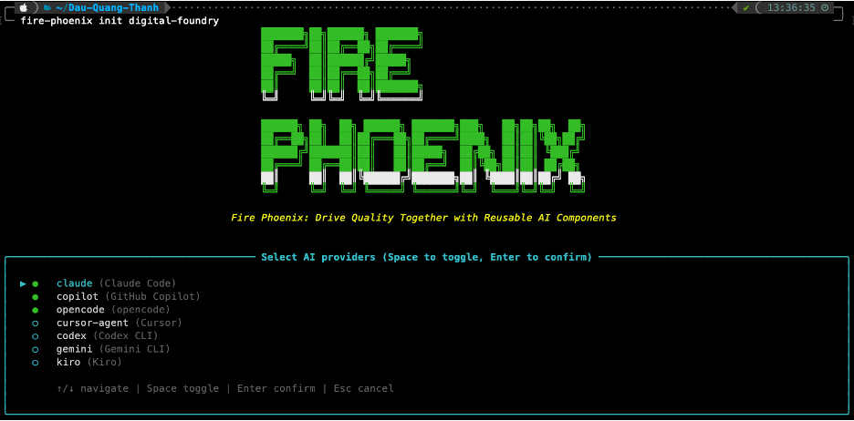

<div align="center">
    <h1>Fire Phoenix</h1>
    <h3><em>Drive Quality Together with Reusable AI Components.</em></h3>
</div>

<p align="center">
    <strong>An open-source AI delivery platform that spans the complete software development lifecycle — from requirements and architecture through implementation, testing, code review, security, and operations. 81 reusable agent skills and 15 role-agent subagents, with native support for greenfield, brownfield, and migration archetypes — bootstrapped into 7 supported AI coding agents with a single command.</strong>
</p>

<p align="center">
    <a href="https://github.com/DauQuangThanh/fire-phoenix/releases/latest"></a>
    <a href="https://github.com/DauQuangThanh/fire-phoenix/stargazers"></a>
    <a href="https://github.com/DauQuangThanh/fire-phoenix/blob/main/LICENSE"></a>
    <a href="https://dauquangthanh.github.io/fire-phoenix/"></a>
    
    
    
</p>

---

## Table of Contents

- [Table of Contents](#table-of-contents)
- [Overview](#overview)
- [What is Intent-Driven Development?](#what-is-intent-driven-development)
- [Getting Started](#getting-started)
  - [1. Install Fire Phoenix](#1-install-fire-phoenix)
    - [Option 1: Pre-built Wheel (Offline-Friendly)](#option-1-pre-built-wheel-offline-friendly)
    - [Option 2: Enterprise / Air-Gapped](#option-2-enterprise--air-gapped)
    - [Option 3: Persistent Installation (Recommended)](#option-3-persistent-installation-recommended)
    - [Option 4: One-time Usage](#option-4-one-time-usage)
    - [Option 5: From Local Source](#option-5-from-local-source)
  - [2. Initialize a Project](#2-initialize-a-project)
  - [3. Establish Project Principles](#3-establish-project-principles)
  - [4. Define the Specification](#4-define-the-specification)
  - [5. Produce a Technical Plan](#5-produce-a-technical-plan)
  - [6. Decompose into Tasks](#6-decompose-into-tasks)
  - [7. Execute the Implementation](#7-execute-the-implementation)
- [Supported AI Coding Agents](#supported-ai-coding-agents)
- [Role Agents](#role-agents)
  - [Execution Modes](#execution-modes)
  - [Artefact Layout](#artefact-layout)
  - [Scope: AI Authoring Only](#scope-ai-authoring-only)
- [Slash Commands](#slash-commands)
  - [Core Commands](#core-commands)
  - [Optional Commands](#optional-commands)
  - [Waterfall / Large-Project Commands](#waterfall--large-project-commands)
  - [Document Conversion Commands](#document-conversion-commands)
- [CLI Reference](#cli-reference)
- [Customization: Extensions, Presets, and Workflows](#customization-extensions-presets-and-workflows)
  - [Extensions — Add New Capabilities](#extensions--add-new-capabilities)
    - [Configure](#configure)
    - [Custom Catalogs](#custom-catalogs)
  - [Presets — Customize Existing Workflows](#presets--customize-existing-workflows)
  - [Workflows — Orchestrate Multi-Step Sequences](#workflows--orchestrate-multi-step-sequences)
  - [Choosing Between Mechanisms](#choosing-between-mechanisms)
- [Core Philosophy](#core-philosophy)
- [Development Phases](#development-phases)
- [Prerequisites](#prerequisites)
- [Detailed Walkthrough](#detailed-walkthrough)
  - [Step 0: Bootstrap](#step-0-bootstrap)
  - [Step 1: Establish Project Principles](#step-1-establish-project-principles)
  - [Step 2: Create the Specification](#step-2-create-the-specification)
  - [Step 3: Clarify the Specification](#step-3-clarify-the-specification)
  - [Step 4: Generate the Plan](#step-4-generate-the-plan)
  - [Step 5: Validate the Plan](#step-5-validate-the-plan)
  - [Step 6: Generate the Task Breakdown](#step-6-generate-the-task-breakdown)
  - [Step 7: Implement](#step-7-implement)
- [Troubleshooting](#troubleshooting)
  - [Git Credential Manager on Linux](#git-credential-manager-on-linux)
- [Support](#support)
- [License](#license)

## Overview

Fire Phoenix is a command-line installer that bootstraps projects for the full software development lifecycle. A single `fire-phoenix init` provisions 81 role-specific AI skills, 15 role-based custom subagents, and a deep customization layer of extensions, presets, and workflows into your project. `fire-phoenix init` scaffolds the L1-L4 IDD artefact hierarchy (`PRODUCT.md` / `STATUS.md` / `CLAUDE.md` / `specs/` / `contracts/` / `adr/` / `decisions.md`) and supports greenfield, brownfield, and migration projects first-class via `--archetype {greenfield,brownfield,migration}`. It also installs a governance guardrail + audit hook pack — a protected-path deny and a tool-call audit trail — into each selected AI tool's native hook config, on by default (see [Governance Hooks](docs/reference/governance-hooks.md)).

The platform covers every delivery phase — requirements gathering, architecture and design, implementation, testing, code review, security review, operations, project management, and formal Waterfall deliverables — across both Agile and hybrid methodologies. It runs offline once installed, integrates with seven AI coding agents across CLI and IDE environments, and works consistently on macOS, Linux, and Windows.



## What is Intent-Driven Development?

Intent-Driven Development (IDD) is a simple idea: capture *why* you are building something and *what* outcome you want before you build it, and keep that intent at the centre of the work.

Most teams write a spec, then ignore it as soon as they start coding — and even when they follow it, a spec that drifts from the original intent quietly steers the work off course. IDD puts the layer above the spec in charge. **Intent is the source of truth.** Specifications, plans, and tasks are *derived* from intent and stay traceable to it: your AI agent reads the intent to shape the work, breaks it into tasks, and writes code that satisfies it. When something needs to change, you change the intent first, and everything downstream re-derives from it.

You stay in charge of the *what* and the *why*. The agent handles most of the *how*.

## Getting Started

### 1. Install Fire Phoenix

> **Important:** The only official, maintained Fire Phoenix packages are published from this GitHub repository. Packages of the same name on PyPI are **not** affiliated with this project. Always install directly from GitHub.

#### Option 1: Pre-built Wheel (Offline-Friendly)

Every GitHub Release ships a pre-built wheel, an sdist, and a `SHA256SUMS` file. The wheel bundles every template, preset, extension, and workflow Fire Phoenix provides:

```bash
# Download from https://github.com/DauQuangThanh/fire-phoenix/releases/tag/v0.34.0
uv tool install --force ./fire_phoenix-0.34.0-py3-none-any.whl
# or, with pip
pip install ./fire_phoenix-0.34.0-py3-none-any.whl
```

Both `fire-phoenix init` and `fire-phoenix upgrade` run fully offline once the wheel is installed.

#### Option 2: Enterprise / Air-Gapped

For environments without PyPI or GitHub access, see the [Offline / Air-Gapped Installation guide](./docs/installation.md) for instructions on building portable wheel bundles from a connected machine.

#### Option 3: Persistent Installation (Recommended)

```bash
uv tool install --from "git+https://github.com/DauQuangThanh/fire-phoenix.git@v0.34.0" fire-phoenix
fire-phoenix --version
```

To upgrade later:

```bash
uv tool install --force --from "git+https://github.com/DauQuangThanh/fire-phoenix.git@v0.34.0" fire-phoenix
```

See the [Upgrade Guide](./docs/upgrade.md) for full upgrade instructions, and the [GitHub Releases page](https://github.com/DauQuangThanh/fire-phoenix/releases) for newer tags as they ship.

#### Option 4: One-time Usage

```bash
uvx --from "git+https://github.com/DauQuangThanh/fire-phoenix.git@v0.34.0" fire-phoenix init <PROJECT_NAME>
```

#### Option 5: From Local Source

```bash
git clone --branch v0.34.0 https://github.com/DauQuangThanh/fire-phoenix.git
cd fire-phoenix
uv build
uv tool install ./dist/fire_phoenix-0.34.0-py3-none-any.whl
```

To rebuild and reinstall after local changes:

```bash
uv build && uv tool install --force "./dist/fire_phoenix-$(grep '^version' pyproject.toml | cut -d'"' -f2)-py3-none-any.whl"
```

**Next steps**

- New to the workflow? Start with the [Quick Start Guide](./docs/quickstart.md).
- Working in small atomic increments? See [Change Class (lightness control)](./docs/concepts/change-class.md) — lightness is a property of the task contract (mechanical / routine / consequential / critical per handbook v1.1 ch. 06 §3), not a parallel skill chain. The earlier `propose → apply → verify → archive` track was retired.

### 2. Initialize a Project

Create a new project, or initialize Fire Phoenix in an existing one:

```bash
# Create a new project (greenfield default — scaffolds L1-L4 IDD hierarchy:
# PRODUCT.md / STATUS.md / CLAUDE.md / specs/ / contracts/ / adr/ / decisions.md)
fire-phoenix init <PROJECT_NAME>

# Initialize in the current directory
fire-phoenix init .
fire-phoenix init --here

# Adopting IDD on an existing codebase? Use --archetype brownfield.
# Scaffolds epistemic-tagged templates (OBSERVED / INFERRED / UNKNOWN)
# and surfaces /inventory-existing + /characterise-behaviour in next steps.
fire-phoenix init . --archetype brownfield

# Migrating a legacy system? --archetype migration adds the source->target
# scaffold + a non-waivable parity obligation + the migration-slice recipe.
fire-phoenix init . --archetype migration

# Opt out of the L1-L4 scaffold entirely (own-governance projects)
fire-phoenix init . --no-scaffold

# Inspect project health
fire-phoenix check
```

### 3. Establish Project Principles

Launch your AI assistant in the project directory. All supported agents expose Fire Phoenix commands as bare `/<skill>` slash commands (e.g. `/intent`, `/plan`).

Use **`/standardize`** to define the governing principles and engineering practices.

```text
/standardize Prioritize code simplicity and maintainability over overly clever implementations. Enforce TypeScript strict mode and Zod input validation on every server boundary. UI must meet WCAG AA. Database access flows through repository functions only. Use Vitest for unit tests, Playwright for end-to-end tests, and require coverage on every public function.
```

### 4. Define the Specification

Use **`/intent`** to describe the product. Concentrate on *what* and *why*, not on the technology.

```text
/intent Build Bookshelf, a single-user reading tracker. Users add books with title, author, and total page count. Each book has a status — wishlist, reading, or finished — and a progress field for the current page. When a book is finished, the user can write a short review and assign a 1-to-5 rating. Books can be tagged with custom categories. The home view shows three shelves grouped by status; tapping a book opens its detail page. No accounts; data persists locally on the device.
```

### 5. Produce a Technical Plan

Use **`/plan`** to specify the technology stack and architecture.

```text
/plan Use Next.js 14 with the App Router and TypeScript. Style with Tailwind CSS and shadcn/ui. Persist data through Prisma with SQLite stored in a local file. Read with Server Components, mutate with Server Actions, and validate every action input with Zod. No authentication.
```

### 6. Decompose into Tasks

Use **`/taskify`** to convert the implementation plan into an actionable task list.

```text
/taskify
```

### 7. Execute the Implementation

Use **`/implement`** to deliver the feature.

```text
/implement
```

## Supported AI Coding Agents

Fire Phoenix integrates with seven AI coding agents across CLI and IDE environments:

Claude Code, GitHub Copilot, Cursor Agent, OpenCode, Kiro, Gemini CLI, and Codex CLI.

For the full matrix — keys, folder layouts, and skills directories — see the [Supported AI Coding Agent Integrations guide](docs/reference/integrations.md). Run `fire-phoenix integration list` to enumerate the integrations available in your installed version.

## Role Agents

In addition to the IDD slash commands, `fire-phoenix init` installs **15 role-based custom subagents** into your AI tool's agents directory (for example, `.claude/agents/`, `.gemini/agents/`, or `.cursor/agents/`). For small atomic changes, IDD uses **change-class lightness** as a property of the task contract (mechanical / routine / consequential / critical per handbook v1.1 ch. 06 §3) — see [Change Class](./docs/concepts/change-class.md). Each subagent is an **AI authoring aid** scoped to a specific role; it delegates to a curated set of skills and writes artefacts to a known location under `docs/`.

| Agent                    | Artefacts                                                            | Delegates to (selection)                                                                                                                  |
| ------------------------ | -------------------------------------------------------------------- | ----------------------------------------------------------------------------------------------------------------------------------------- |
| `business-analyst`       | L1 PRODUCT.md + L2 epic-specs, acceptance criteria, UAT plan, data migration plan | `intent` (L1 + L2 modes), `clarify-intent`, `acceptance-criteria`, `user-acceptance-test-plan`, `data-migration-plan` |
| `architect`              | Architecture intake, technology research, ADRs, C4 diagrams          | `plan`, `standardize`, `architecture-intake`, `technology-research`, `adr-author`, `c4-diagrams`                           |
| `developer`              | Detailed design, API contract, data model, unit-test skeletons       | `plan`, `implement`, `standardize`, `development-design`, `unit-tests`                                                   |
| `test-architect`         | Test strategy, framework, quality gates, RTM               | `plan`, `standardize`, `test-strategy`, `test-framework`, `quality-gates`, `traceability-matrix`          |
| `tester`                 | Test cases, execution ledger, bug reports, regression index          | `taskify`, `verify-tasks`, `test-cases`, `test-execution`, `bug-report`, `regression-tests`                 |
| `bug-fixer`              | Bug triage, fixes, regression tests, change log                      | `implement`, `verify-tasks`, `bug-triage`, `regression-tests`, `change-log`                                      |
| `code-quality-reviewer`  | Maintainability review, complexity and SOLID/DRY/Fire Phoenix findings       | `standardize`, `quality-review`                                                                                                 |
| `code-security-reviewer` | OWASP Top 10 / STRIDE review, dependency audit                       | `security-review`, `dependency-audit`                                                                                           |
| `asset-security-reviewer` | Security-reviews the installed agent assets themselves (subagent/skill bodies, scripts, hooks) for injection, malicious scripts, credential theft, supply-chain, privilege escalation | `agent-asset-security-review`, `dependency-audit`                                                             |
| `devops`                 | CI/CD, IaC, containers, observability, deployment runbook, ops handover, migration runbook | `cicd-pipeline`, `infrastructure-plan`, `containerization`, `observability-plan`, `deployment-strategy`, `handover`, `data-migration-plan` |
| `product-owner`          | Backlog, acceptance criteria, roadmap, GitHub issues                 | `tasks-to-issues`, `backlog`, `acceptance-criteria`, `roadmap`                                                         |
| `project-manager`        | Project plan, WBS, risk register, phase gates, baselines, status reports, change control | `taskify`, `feature-checklist`, `standardize`, `project-planning`, `work-breakdown-structure`, `phase-gate`, `baseline`, `risk-register`, `status-report`, `change-control` |
| `scrum-master`           | Sprint plan, standup log, retrospective synthesis                    | `taskify`, `feature-checklist`, `sprint-planning`, `standup`, `retrospective`                                    |
| `technical-analyst`      | Codebase scan, extracted architecture, API docs, dependency map      | `codebase-scan`, `architecture-extraction`, `api-docs`, `dependency-map`                                                      |
| `ux-designer`            | Low-fidelity wireframes and Mermaid user flows                       | `wireframes`                                                                                                                         |

### Execution Modes

Every role agent supports two execution modes:

- **`interactive` (default)** — Evaluate the task, clarify scope and expectations, then execute step by step with confirmation at each decision point.
- **`auto`** — Complete the task from user input, project context, and the agent's own knowledge. Assumptions and non-trivial decisions are recorded to `docs/agent-decisions/<agent-name>/<YYYY-MM-DD>-decisions.md` using four decision kinds: `default-applied`, `alternative-picked`, `autonomous-action`, and `debt-overridden`.

Select a mode by including a keyword in the first message (`"in auto mode, ..."` or `"interactively, ..."`), or by setting `FIRE_PHOENIX_AGENT_MODE=auto` in the environment. The mode propagates to the skill layer: `auto` runs skill scripts with `--auto` / `-Auto`.

### Artefact Layout

Every role writes under a **work-type directory** rather than a per-role directory, so related artefacts cluster regardless of which agent authored them:

| Directory                       | Example Contents                                                                                                              |
| ------------------------------- | ----------------------------------------------------------------------------------------------------------------------------- |
| `docs/architecture/`            | `intake.md`, `srs.md`, `c4-context.md`, `c4-container.md`, `extracted.md`, `tech-debts.md`                                   |
| `docs/decisions/`               | `ADR-NNN-<slug>.md` (one ADR per file)                                                                                        |
| `docs/research/`                | `<topic>.md` — technology research                                                                                            |
| `docs/design/<feature>/`        | `design.md`, `api-contract.md`, `data-model.md`                                                                               |
| `docs/testing/<feature>/`       | `strategy.md`, `framework.md`, `quality-gates.md`, `test-cases.md`, `execution.md`, `test-debts.md`, `regression-index.md`           |
| `docs/analysis/`                | `codebase-scan.md`, `api-docs.md`, `dependencies.md`, `traceability-matrix.md`, `srs.md`, `uat-plan/<feature>/uat-plan.md`, `data-migration-plan.md`, `field-mapping.md` |
| `docs/bugs/`                    | `BUG-NNN-<slug>.md`, `triage.md`, `change-register.md`, `fix-debts.md`                                                        |
| `docs/reviews/<feature>/`       | `quality.md`, `security.md`, `dependencies.md`, plus shared `docs/reviews/{quality,security}-debts.md`                       |
| `docs/operations/`              | `cicd.md`, `infra.md`, `containers.md`, `monitoring.md`, `deployment.md`, `migration-runbook.md`, `handover/`  |
| `docs/product/`                 | `backlog.md`, `acceptance.md`, `roadmap.md`                                                                                   |
| `docs/project/`                 | `project-plan.md`, `wbs-index.md`, `risk-register.md`, `status-YYYY-MM-DD.md`, `change-log.md`, `gates/`, `pm-debts.md`      |
| `docs/baselines/<label>/`       | `manifest.md`, `artefacts/` (frozen copies with SHA-256 hashes)                                                              |
| `docs/agile/`                   | `sprint-NN-plan.md`, `standups/YYYY-MM-DD.md`, `retro-sprint-NN.md`                                                           |
| `docs/ux/<feature>/`            | `wireframes.md`, `user-flows.md`                                                                                              |
| `docs/agent-decisions/<agent>/` | Per-run decision log (auto mode)                                                                                              |

All paths resolve through `.fire-phoenix/context.yml`. Adjust `paths.docs` if your project stores documentation outside `docs/`.

### Scope: AI Authoring Only

Role agents are **authoring aids**, not meeting facilitators or stakeholder proxies. They draft artefacts, solicit input from the user at the keyboard, and honour `preferences.confirm_before_write`.

They do **not** facilitate standups, sprint planning, or retrospectives; interview stakeholders or end users; convene change-control boards; negotiate with vendors; approve or sign off on decisions; or communicate with third parties through any channel. Each agent's prompt enumerates its `does` and `does not` lists explicitly.

## Slash Commands

After `fire-phoenix init`, your AI coding agent gains access to the slash commands listed below. All supported agents use the bare `/<skill>` invocation format.

### Core Commands

Essential for the Intent-Driven Development workflow:

| Command                  | Agent Skill            | Description                                                                |
| ------------------------ | ---------------------- | -------------------------------------------------------------------------- |
| `/standardize`      | `standardize`     | Create or update governing principles and development guidelines.          |
| `/intent`          | `intent`         | Define what to build — requirements and user stories.                      |
| `/plan`             | `plan`            | Produce a technical implementation plan with the chosen stack.             |
| `/taskify`          | `taskify`         | Generate an actionable task list for implementation.                       |
| `/tasks-to-issues`  | `tasks-to-issues` | Convert generated tasks into GitHub issues for tracking and execution.     |
| `/implement`        | `implement`       | Execute the task list and build the feature according to the plan.        |

### Optional Commands

For enhanced quality and validation:

| Command                 | Agent Skill             | Description                                                                                                |
| ----------------------- | ----------------------- | ---------------------------------------------------------------------------------------------------------- |
| `/clarify-intent`   | `clarify-intent`    | Resolve underspecified areas. Recommended before `/plan`.                                             |
| `/verify-tasks`    | `verify-tasks`     | Cross-artefact consistency and coverage analysis. Run after `/taskify` and before `/implement`.  |
| `/feature-checklist`       | `feature-checklist`        | Generate quality checklists that validate requirements completeness, clarity, and consistency.             |

### Waterfall / Large-Project Commands

Additional skills for formal delivery lifecycles — Waterfall, government contracts, regulated industries, and any project that requires phase gates, traceability, or formal hand-overs.

| Command                        | Agent Skill                   | Description                                                                                                     |
| ------------------------------ | ----------------------------- | --------------------------------------------------------------------------------------------------------------- |
| `/traceability-matrix`    | `traceability-matrix`    | Build a Requirements Traceability Matrix (RTM) linking FR/NFR → design → tasks → tests → bugs.                 |
| `/phase-gate`             | `phase-gate`             | Author a Waterfall phase-exit checklist and sign-off record (SRR, CDR, TRR, ORR, go-live).                     |
| `/work-breakdown-structure`          | `work-breakdown-structure`          | Decompose the project-plan WBS into feature stub directories, bridging planning and specification.              |
| `/baseline`               | `baseline`               | Snapshot artefacts as a named, immutable baseline with SHA-256 manifest and optional git tag.                   |
| `/user-acceptance-test-plan`               | `user-acceptance-test-plan`               | Draft a business-workflow-level UAT plan with scenarios, entry/exit criteria, and a sponsor sign-off ledger.    |
| `/handover`               | `handover`               | Draft the operations/support hand-over package — runbook index, L1/L2/L3 escalation matrix, training plan.     |
| `/data-migration-plan`    | `data-migration-plan`    | Draft a data migration plan covering strategy, field mapping, ETL outline, cutover window, and rollback.        |

### Document Conversion Commands

Round-trip translation between Office formats and Markdown for version-control-friendly editing:

| Command              | Agent Skill          | Description                                                                                          |
| -------------------- | -------------------- | ---------------------------------------------------------------------------------------------------- |
| `/docx-markdown` | `docx-markdown` | Convert `.docx` ↔ Markdown with high-fidelity round-trip via pandoc + sidecar metadata.             |
| `/pptx-markdown` | `pptx-markdown` | Convert `.pptx` ↔ Markdown preserving slide structure, notes, layouts, and images.                  |
| `/xlsx-markdown` | `xlsx-markdown` | Convert `.xlsx` ↔ Markdown preserving sheets, formulas, named ranges, and formatting via sidecar.   |

## CLI Reference

For complete command details, options, and examples, see the [CLI Reference](docs/reference/overview.md).

## Customization: Extensions, Presets, and Workflows

> **Start here:** the [Customization Model](./docs/concepts/customization-model.md) is the canonical mental-model page. It maps every customization request ("I want to add a command", "I want to change a template", "I want to chain skills together", "I want to target a new AI agent") to one of six surfaces — **skills**, **subagents**, **presets**, **extensions**, **workflows (engine)**, and **integrations** — with a decision tree and a per-surface comparison table. The summary below is a one-screen overview; the concept page is the authoritative entry point.

In short: **presets override the templates and command bodies** of existing skills (no new commands). **Extensions add new commands and hooks**. **Workflows orchestrate linear multi-step YAML sequences** with checkpoints and resume. **Integrations target one of the seven supported AI agents** (Claude Code, GitHub Copilot, Cursor, OpenCode, Kiro, Gemini CLI, Codex). Pick the surface that matches your need — the concept page links to per-surface references and authoring tutorials.

Fire Phoenix can be tailored through three complementary mechanisms — **extensions**, **presets**, and **workflows** — plus project-local overrides for one-off adjustments.

| Priority | Component   | Purpose                                              | Location                                         |
| -------: | ----------- | ---------------------------------------------------- | ------------------------------------------------ |
|        1 | Presets     | Customize the format of core and extension artefacts | `.fire-phoenix/presets/<name>/`                          |
|        2 | Extensions  | Add new capabilities                                 | `.fire-phoenix/extensions/<name>/`                       |
|        3 | Fire Phoenix Core   | Built-in IDD skills                                  | `<agent-config>/skills/<fire-phoenix-name>/` (per-skill) |

Workflows orchestrate multi-step sequences across these layers and are resolved independently from the catalog.

- **Skills are self-contained.** Each installed skill is a folder bundling its `SKILL.md` (or `.md` / `.toml` for flat-file agents) with the scripts and templates it requires. For example, `/intent` installs to `.claude/skills/intent/` alongside `scripts/bash/create-new-feature.sh` and `templates/spec-template.md`. There is no shared `.fire-phoenix/scripts/` or `.fire-phoenix/templates/` directory.
- **Extension and preset commands** are applied at **install time**. When you run `fire-phoenix extension add` or `fire-phoenix preset add`, command files are written into the agent directory and overrides take effect immediately.
- When multiple presets or extensions provide the same command, the highest-priority version wins. On removal, the next-highest-priority version is restored automatically.

### Extensions — Add New Capabilities

Use **extensions** to introduce functionality beyond the Fire Phoenix core: domain-specific commands, external tool integrations, additional development phases, or quality gates.

Typical extensions include Jira/Linear ticket sync, post-implementation code review, V-Model test traceability, project health diagnostics, and Git feature-branch automation (the bundled `git` extension).

```bash
# Browse the catalog
fire-phoenix extension search
fire-phoenix extension search --tag workflow
fire-phoenix extension info <name>

# Install (requires a project initialized with `fire-phoenix init`)
fire-phoenix extension add <name>
fire-phoenix extension add <name> --dev --from ./path/to/extension
fire-phoenix extension add <name> --from https://example.com/my-extension.zip

# Manage installed extensions
fire-phoenix extension list
fire-phoenix extension update <name>
fire-phoenix extension disable <name>
fire-phoenix extension set-priority <name> 5
fire-phoenix extension remove <name>
```

After installation, commands appear in the agent's directory (for example, `.claude/skills/` or `.github/prompts/`) and are invoked as `/fire-phoenix.<ext>.<command>`.

#### Configure

Most extensions ship with a configuration template:

```bash
cp .fire-phoenix/extensions/<name>/<name>-config.template.yml \
   .fire-phoenix/extensions/<name>/<name>-config.yml
```

Configuration merge order (later wins): extension defaults → `<name>-config.yml` → `<name>-config.local.yml` → `FIRE_PHOENIX_<NAME>_*` environment variables.

#### Custom Catalogs

```bash
fire-phoenix extension catalog list
fire-phoenix extension catalog add https://example.com/catalog.json \
  --name my-org --priority 5 --install-allowed
fire-phoenix extension catalog remove my-org
```

Catalogs stack by priority — lower numbers take precedence. Override every catalog in CI by exporting `FIRE_PHOENIX_CATALOG_URL=https://.../catalog.json`.

See the [Extensions reference](docs/reference/extensions.md) and the [Extension User Guide](https://github.com/DauQuangThanh/fire-phoenix/blob/main/extensions/EXTENSION-USER-GUIDE.md) for end-to-end workflows.

### Presets — Customize Existing Workflows

Use **presets** to change *how* Fire Phoenix operates without adding new capabilities. Presets override the templates and commands shipped with the core *and* with installed extensions — for example, enforcing a compliance-oriented spec format, applying domain-specific terminology, or aligning artefacts with organizational standards.

```bash
fire-phoenix preset search
fire-phoenix preset add <preset_id>
fire-phoenix preset list
fire-phoenix preset resolve <name>     # trace which file wins resolution
fire-phoenix preset set-priority <preset_id> 5
```

Common preset use cases include restructuring spec templates for regulatory traceability, adapting the workflow to a methodology (Agile, Kanban, Waterfall, jobs-to-be-done, domain-driven design), adding mandatory security-review gates, enforcing test-first task ordering, and localizing artefacts into a different language.

See the [Presets reference](docs/reference/presets.md) for resolution order and priority stacking.

### Workflows — Orchestrate Multi-Step Sequences

**Workflows** chain commands, prompts, and human checkpoints (`command`/`prompt`/`gate`) into repeatable linear sequences, with pause/resume from the exact step where execution stopped. The engine is a linear verb executor — no conditional/loop/fan-out control flow and no shell step.

```bash
# Discover and install
fire-phoenix workflow search
fire-phoenix workflow add <source>
fire-phoenix workflow list

# Run the default full IDD cycle (viet-paracel), inputs supplied via -i key=value
fire-phoenix workflow run viet-paracel \
  -i intent="Build Bookshelf, a single-user reading tracker" \
  -i scope=full

# Resume after a gate, manual checkpoint, or fix
fire-phoenix workflow resume <run_id>
fire-phoenix workflow status <run_id>
```

The run shows per-step progress (`✓`/`✗`/`⏸`) with the Run ID upfront; pass `--stream` for live agent output. See the [Workflows reference](docs/reference/workflows.md) for the full command surface.

### Choosing Between Mechanisms

| Goal                                              | Choose     |
| ------------------------------------------------- | ---------- |
| Add a new command or capability                   | Extension  |
| Customize the format of specs, plans, or tasks    | Preset     |
| Integrate an external tool or service             | Extension  |
| Enforce organizational or regulatory standards    | Preset     |
| Automate a multi-step, multi-checkpoint sequence  | Workflow   |
| Ship reusable domain-specific templates           | Preset (for overrides) or Extension (when bundled with new commands) |

## Core Philosophy

Intent-Driven Development is a structured process that emphasizes:

- **Intent as the source of truth**, captured before the "*what*" and the "*how*" — the *why* and the desired outcome that every downstream artefact must trace back to.
- **Derived, traceable artefacts**: specifications, plans, and tasks are generated from intent and kept aligned to it, rather than standing alone.
- **Multi-step refinement** in place of one-shot code generation from prompts.
- **Deep use of advanced AI capabilities** for interpreting intent and synthesising the work that satisfies it.

## Development Phases

| Phase                                     | Focus                     | Key Activities                                                                                                                                                      |
| ----------------------------------------- | ------------------------- | ------------------------------------------------------------------------------------------------------------------------------------------------------------------- |
| **0-to-1 Development** ("Greenfield")     | Generate from scratch     | <ul><li>Start from high-level requirements</li><li>Generate specifications</li><li>Plan implementation steps</li><li>Build production-ready applications</li></ul> |
| **Creative Exploration**                  | Parallel implementations  | <ul><li>Explore diverse solutions</li><li>Support multiple technology stacks and architectures</li><li>Experiment with UX patterns</li></ul>                       |
| **Iterative Enhancement** ("Brownfield")  | Brownfield modernization  | <ul><li>Add features iteratively</li><li>Modernize legacy systems</li><li>Adapt processes over time</li></ul>                                                      |

## Prerequisites

- Linux, macOS, or Windows.
- A [supported](#supported-ai-coding-agents) AI coding agent.
- [uv](https://docs.astral.sh/uv/) for package management.
- [Python 3.11+](https://www.python.org/downloads/).
- [Git](https://git-scm.com/downloads).

If you encounter issues with a specific agent, please open an issue so the integration can be refined.

## Detailed Walkthrough

<details>
<summary>Step-by-step implementation guide</summary>

The example below builds **Bookshelf**, a single-user reading tracker, from a blank repository.

### Step 0: Bootstrap

```bash
# Create a new project, with interactive multi-select for integrations
fire-phoenix init bookshelf

# Or initialize Fire Phoenix in the current repository
fire-phoenix init .
fire-phoenix init --here --force      # merge into a non-empty directory

# Specify integrations non-interactively
fire-phoenix init bookshelf --integration claude --integration copilot

# Use the generic integration for an unlisted agent
fire-phoenix init bookshelf --integration generic --integration-options="--commands-dir .myagent/commands"

# Skip CLI tool checks
fire-phoenix init bookshelf --integration claude --ignore-agent-tools
```


### Step 1: Establish Project Principles

Launch your AI agent (for example, `claude`) inside the project directory.

Setup is correct when `/standardize`, `/intent`, `/plan`, `/taskify`, and `/implement` are listed.

```text
/standardize Establish principles for Bookshelf. Prioritize code simplicity and maintainability over overly clever implementations. Enforce TypeScript strict mode and Zod validation on every server boundary. UI must meet WCAG AA. Database access flows through repository functions only. Tests run with Vitest (unit) and Playwright (end-to-end), and every public function requires test coverage.
```

This creates or updates `docs/standards.md`, which subsequent commands consult.

### Step 2: Create the Specification

> [!IMPORTANT]
> Be explicit about *what* you are building and *why*. **Do not focus on the technology stack at this stage.**

```text
/intent Build Bookshelf, a single-user reading tracker. A user adds books with title, author, and total page count. Each book has a status — wishlist, reading, or finished — and a current-page field. When a book is finished, the user can write a short review and assign a 1-to-5 rating. Books can be tagged with custom categories. The home view shows three shelves grouped by status; tapping a book opens its detail page. No accounts; data persists locally.
```

After the prompt is submitted, the agent begins planning, drafts a specification, and triggers built-in scripts that prepare the repository. On completion, a feature branch is created (for example, `001-bookshelf`) with a specification under `specs/001-bookshelf/intent.md`.

Project layout at this stage:

```text
├── .claude
│   └── skills
│       ├── intent
│       │   ├── SKILL.md
│       │   ├── scripts/bash/{create-new-feature,common}.sh
│       │   ├── scripts/powershell/{create-new-feature,common}.ps1
│       │   └── templates/spec-template.md
│       ├── plan
│       │   ├── SKILL.md
│       │   ├── scripts/bash/{setup-plan,common}.sh
│       │   ├── scripts/powershell/{setup-plan,common}.ps1
│       │   └── templates/plan-template.md
│       ├── standardize/…
│       └── {taskify,verify-tasks,clarify-intent,feature-checklist,implement,tasks-to-issues}/…
├── .fire-phoenix
│   ├── context.yml
│   ├── integration.json
│   └── manifest.json
└── docs
    ├── standards.md
    └── specs
        └── 001-bookshelf
            └── intent.md
```

### Step 3: Clarify the Specification

Run the structured clarification workflow **before** producing a technical plan to minimize rework.

```text
/clarify-intent Focus on the rules around progress tracking and the review/rating flow.
```

Optionally follow with ad-hoc refinement:

```text
The progress field accepts values from 0 to the book's total pages. When progress equals the total, prompt the user to mark the book as finished. Reviews accept up to 1,000 characters and may be edited until a book is moved back to "reading".
```

Validate the **Review & Acceptance Checklist**:

```text
Read the review and acceptance checklist and check off each item if the spec satisfies the criterion.
```

If the project is exploratory (a spike or prototype), state that explicitly so the agent does not block on missing clarifications.

### Step 4: Generate the Plan

```text
/plan Use Next.js 14 with the App Router and TypeScript. Style with Tailwind CSS and shadcn/ui. Persist data through Prisma against a local SQLite file. Read with Server Components, mutate with Server Actions, and validate every action input with Zod. No authentication.
```

Output:

```text
.
├── CLAUDE.md
├── .claude/skills/…
├── .fire-phoenix/
│   ├── context.yml
│   ├── integration.json
│   └── manifest.json
└── docs
    ├── standards.md
    └── specs
        └── 001-bookshelf
            ├── contracts
            │   └── api-spec.json
            ├── data-model.md
            ├── plan.md
            ├── quickstart.md
            ├── research.md
            └── intent.md
```

Inspect `research.md` to confirm the chosen stack matches your intent. Ask the agent to refine specifics — for example, the Prisma schema or the Server Actions contract — and to verify the locally installed Node.js version.

For rapidly evolving libraries, request targeted parallel research:

```text
Identify which decisions in plan.md depend on Next.js 14 App Router behaviour that has changed recently. For each, spawn a focused research task. Update research.md with version-specific findings.
```

> [!NOTE]
> The agent may add components that were not requested. Ask for the rationale and source of any such additions.

### Step 5: Validate the Plan

```text
Audit plan.md and the implementation-detail files. For each task, verify that the relevant data-model, contract, and research notes are referenced so a developer can follow the steps without ambiguity.
```

Run the checklist a second time before implementation begins. If the [GitHub CLI](https://docs.github.com/en/github-cli/github-cli) is installed, the agent can also open a pull request from the feature branch to `main` with a detailed description for review.

> [!NOTE]
> Before implementation, ask the agent to flag over-engineered components. The plan must adhere to the [standards](docs/standards.md) as the foundation for every decision.

### Step 6: Generate the Task Breakdown

```text
/taskify
```

This creates `tasks.md` in the feature directory, containing:

- **Task breakdown organized by user story.** Each user story becomes a separate implementation phase.
- **Dependency management.** Tasks are ordered to respect dependencies (for example, Prisma schema before repository functions, repository functions before Server Actions).
- **Parallel execution markers.** Tasks eligible for parallel execution are marked with `[P]`.
- **File-path specifications.** Each task lists the exact paths where implementation should occur.
- **Test-driven structure.** Test tasks precede their corresponding implementation tasks.
- **Checkpoint validation.** Each user-story phase ends with a checkpoint that validates independent functionality.

### Step 7: Implement

```text
/implement
```

`/implement` will:

- Validate that all prerequisites are present (standards, spec, plan, and tasks).
- Parse the task breakdown from `tasks.md`.
- Execute tasks in the correct order, respecting dependencies and parallel markers.
- Follow the TDD approach defined in the task plan.
- Report progress and handle errors.

> [!IMPORTANT]
> The AI agent executes local CLI commands (for example, `npm`, `npx prisma`, `npm test`). Ensure the required tools are installed.

After implementation completes, run the application and resolve any runtime errors not surfaced in CLI logs (for example, browser console errors). Paste such errors back to the agent for resolution.

</details>

---

## Troubleshooting

### Git Credential Manager on Linux

If Git authentication fails on Linux, install the Git Credential Manager:

```bash
#!/usr/bin/env bash
set -e
echo "Downloading Git Credential Manager v2.6.1..."
wget https://github.com/git-ecosystem/git-credential-manager/releases/download/v2.6.1/gcm-linux_amd64.2.6.1.deb
echo "Installing Git Credential Manager..."
sudo dpkg -i gcm-linux_amd64.2.6.1.deb
echo "Configuring Git to use GCM..."
git config --global credential.helper manager
echo "Cleaning up..."
rm gcm-linux_amd64.2.6.1.deb
```

## Support

To report issues, request features, or ask questions about Intent-Driven Development, please open a [GitHub issue](https://github.com/DauQuangThanh/fire-phoenix/issues/new).

## License

Fire Phoenix is released under the MIT License. See the [LICENSE](https://github.com/DauQuangThanh/fire-phoenix/blob/main/LICENSE) file for full terms.
